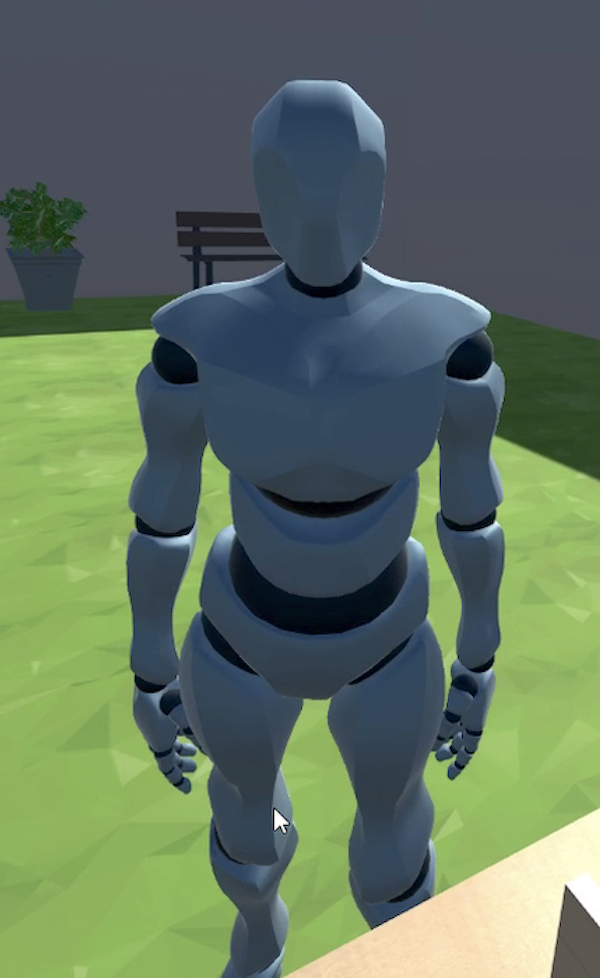

# VR Ball Shooter  :basketball::gun:
a ball shooting game in VR 
 

## Project Title
**VR Ball Shooter**
* This game was originally developed in *Unity 3D* for use with *Oculus Rift* and *Oculus Touch* controllers.
 

## Motivation
* This ball shooting game was conducted in the user study for my bachelor thesis *"The effect of Extrinsic and Intrinsic Interruptions in Co-located Mixed Presence Environments"*. 
 

## Task & Features
* For this game participants shoot oncoming **yellow and blue balls** by clicking on their controllers with **a limited amount of time**. 
They have to click on **the left controller** to shoot the yellow ball and on **the right controller** to shoot the blue ball. 
Balls come randomly from the left or right side.

* There are **five ball shooters** from which balls pop out **at random**. 
The ball shooters are programmed with a script for shooting a ball once **every 1.5 seconds with a timer function**. 

* Game elements such as **animations, sounds, and a textual representation** of the current score and remaining time. 

* The **pause and resume** panel: the user can pause the game at any time.
 

## Screenshot & Demo Video
To see a demo video, click the screenshot. (:link: **youtube** link)

* *(Left)* Screenshot of the Unity scene view: there are five ball
shooters from which balls pop out at random. 
* *(Middle)* The view of the HMD user: the user shoots
the blue ball with the blue pistol. The red bullet is fired. 
* *(Right)* The pause and resume panel: the
user can pause the game at any time.
 

## Built With

* [Mixamo](https://www.mixamo.com/#/) - 3D models and animation sequences
* For the avatar, we downloaded customizable 3D characters which Mixamo software built for game developers.

## Applied techniques
The software and hardware used for the realization of the concept are the following: 

* ### Hardware:
*Oculus Rift HMD, Oculus Touch controllers, Oculus Rift sensors*.

* ### Software: 
this application was developed in *Unity3D* which is a game development environment and engine and written in *C#*. 
*The Local Avatar Prefab* from Oculus asset was attached to provide the full functionality of the Oculus Touch Controllers.

